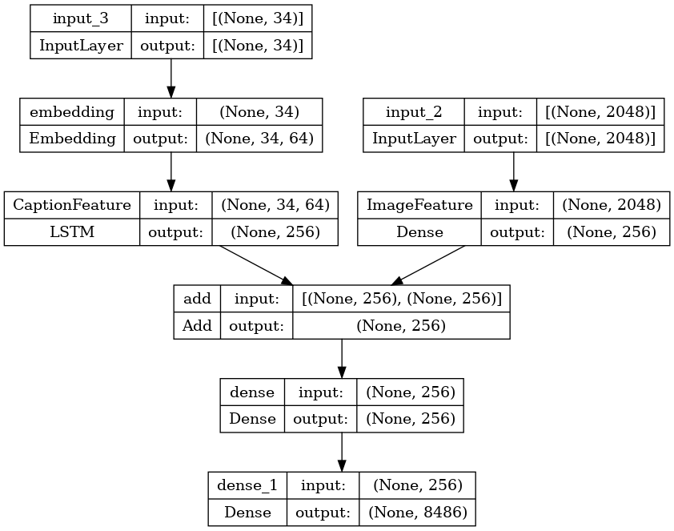

# Image Captioning Project

## Overview
This project implements an image captioning system that can automatically generate descriptive captions for images. The model combines computer vision and natural language processing techniques to understand the content of an image and describe it in natural language.

## Features
- Automatic generation of descriptive captions for images
- Pre-trained ResNet50V2 for feature extraction from images
- LSTM-based language model for caption generation
- BLEU score evaluation for caption quality assessment
- Support for the Flickr8k dataset

## Architecture
The model uses a combined architecture:
1. **Image Feature Extraction**: ResNet50V2 is used to extract high-level features from images
2. **Caption Generation**: An LSTM network processes the image features and generates captions word by word
3. **Training**: The model is trained on pairs of images and their corresponding captions



## Requirements
- Python 3.6+
- TensorFlow 2.x
- Numpy
- Pandas
- Matplotlib
- NLTK
- tqdm

## Setup and Installation
```bash
# Clone the repository
git clone https://github.com/yourusername/image-captioning.git
cd image-captioning

# Install dependencies
pip install -r requirements.txt

# Download and prepare the Flickr8k dataset
# (Follow the instructions in data_preparation.md)
```

## Dataset
This project uses the Flickr8k dataset, which contains 8,000+ images with 5 captions each. The dataset is structured as follows:
- `Images/`: Contains all the images
- `captions.txt`: Contains image filenames and their corresponding captions

## Results
The model achieves the following BLEU scores on the test set:
- BLEU-1: ~0.6
- BLEU-2: ~0.4
- BLEU-3: ~0.3
- BLEU-4: ~0.2

Example captions generated by the model:

| Image | Generated Caption | Ground Truth Caption |
|-------|-------------------|----------------------|
| [Image 1] | "a child in a pink dress is climbing up a set of stairs" | "a child in a pink dress is climbing up a set of stairs in an entry way" |
| [Image 2] | "a black dog and a white dog are playing" | "a black dog and a tri-colored dog playing with each other on the road" |

## Model Performance
The training and validation loss curves indicate that the model starts to overfit after about 7-8 epochs:


## Future Improvements
- Implement attention mechanism to improve the quality of generated captions
- Try different pre-trained CNNs for feature extraction (e.g., EfficientNet, VGG)
- Experiment with Transformer-based architectures
- Expand the dataset to include more diverse images
- Implement beam search for caption generation
